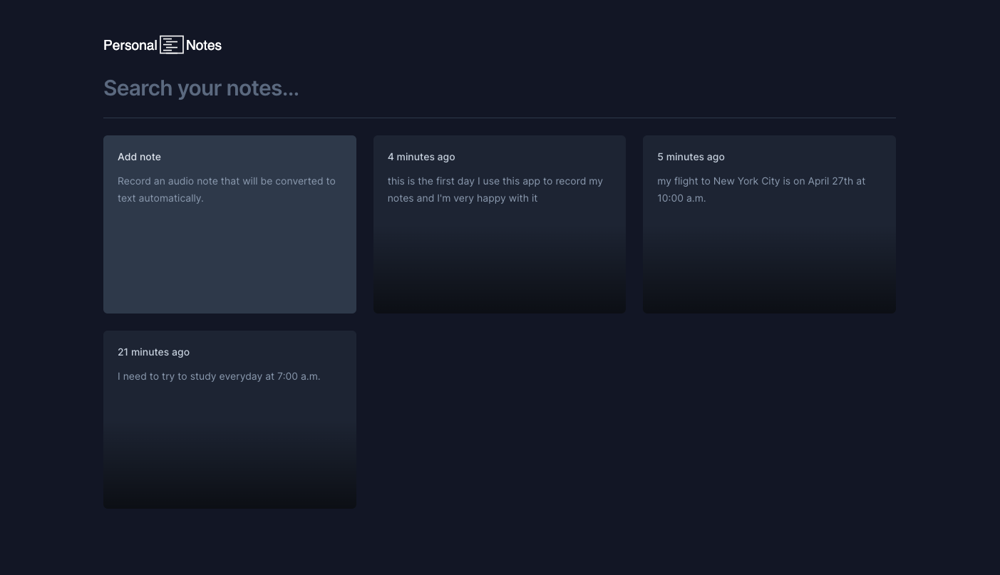
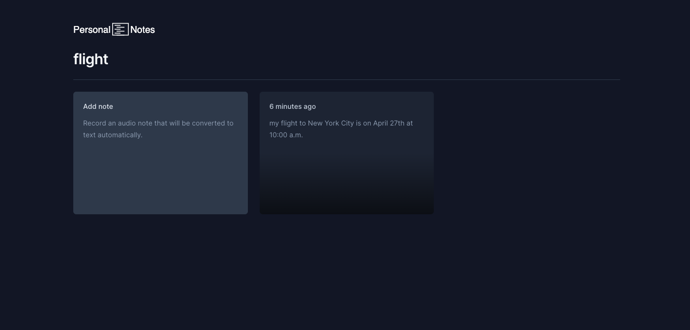
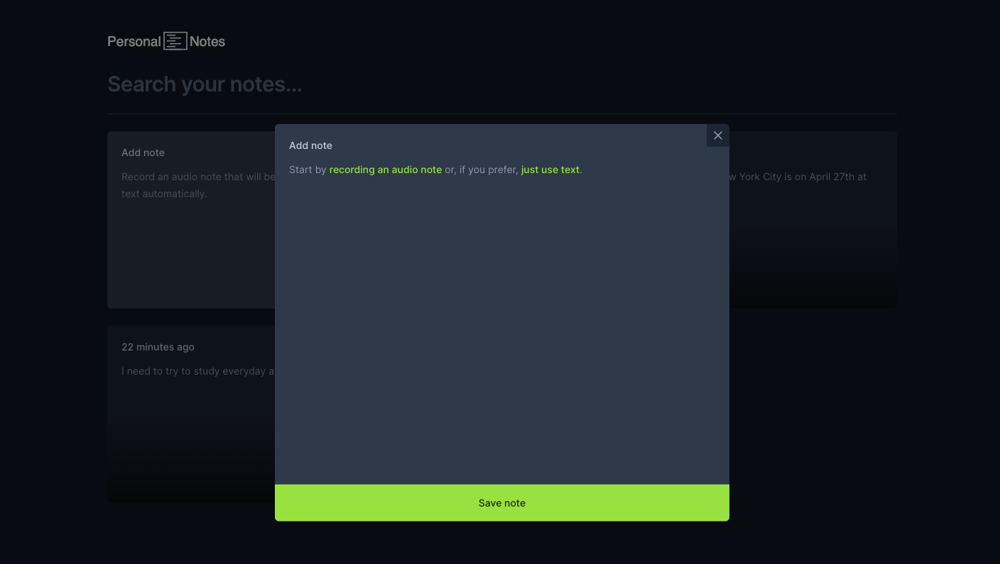
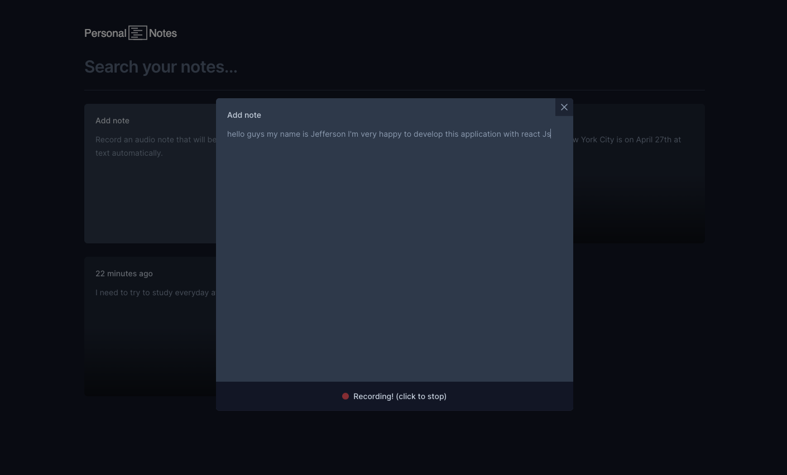

<div align="center" style="margin-bottom: 20px;">
  <div>
    <h1>PERSONAL NOTES</h1>
    
  </div>

  <div align="center">
    
    
    
    
  </div>
</div>

## :memo: About project

This project features a tool dedicated to creating personal notes conveniently. It offers the ability to create notes through typing or direct speech transcription, leveraging browser resources such as the Speech Recognition API. The main technologies employed in the development of this project include Vite, ReactJS, Tailwind CSS, and TypeScript. Explore the convenience and efficiency of this application to organize your ideas and thoughts in a simple and accessible manner.

## :rocket: Technologies

- [Vite](https://vitejs.dev/)
- [ReactJS](https://react.dev/learn)
- [TypeScript](https://www.typescriptlang.org/)
- [Tailwind CSS](https://tailwindcss.com/)
- [Radix UI](https://www.radix-ui.com/primitives)
- [Lucide](https://lucide.dev/guide/packages/lucide-react)
- [Sonner](https://sonner.emilkowal.ski/)

## :cyclone: Run this project

```bash
# Clone this project
$ git clone https://github.com/jefferson1104/personal-notes.git

# Project directory
$ cd personal-notes

# Install dependencies
$ npm install

# run the project as development mode
$ npm run dev

# open in your browser
http://localhost:5173
```

## :art: Screenshots





